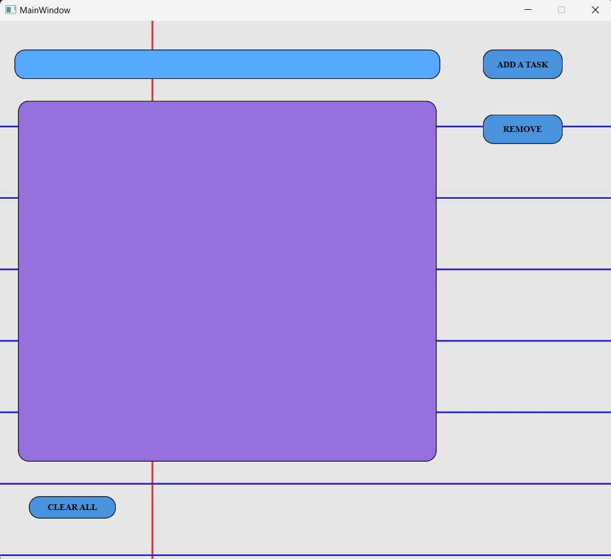
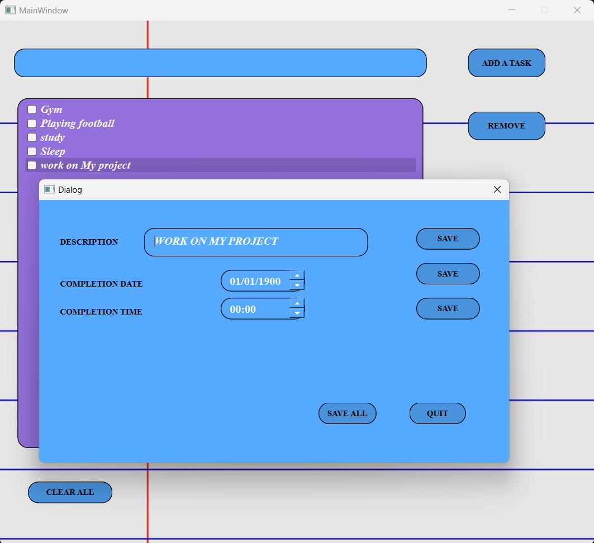

# Task Manager Application

## Overview

The **Task Manager Application** is a desktop application built using Qt and C++. It provides a user-friendly interface for managing tasks, allowing users to add, edit, remove, and mark tasks as completed. This project demonstrates the integration of C++ backend logic with a Qt GUI, incorporating features such as file I/O for saving and loading tasks, and dynamic UI updates.

## Features

- **Add Tasks**: Easily add new tasks with a description.
- **Edit Tasks**: Double-click on any task to open an edit dialog and make changes.
- **Remove Tasks**: Select and remove tasks with a single click.
- **Mark Tasks as Completed**: Check off tasks to mark them as completed.
- **Persistent Storage**: Save and load tasks from a file to ensure data is not lost between sessions.
- **Custom Styling**: Includes custom styling for buttons and task items to enhance the visual appeal.
- **Keyboard Shortcuts**: Press Enter to quickly add a new task.

## Technical Details

- **Language**: C++
- **GUI Framework**: Qt
- **File I/O**: Save and load tasks from a file using standard file streams.
- **Custom Styling**: Applied through Qt stylesheets and programmatic adjustments.

## Getting Started

### Prerequisites

- **Qt**: Make sure you have the Qt framework installed on your system.

### Installation

1. **Clone the repository**:
    ```bash
    git clone https://github.com/yourusername/task-manager-app.git
    cd task-manager-app
    ```

2. **Build the project**:
    Open the project in Qt Creator or use the following commands:
    ```bash
    mkdir build
    cd build
    qmake ..
    make
    ```

3. **Run the application**:
    ```bash
    ./TaskManagerApp
    ```

## Screenshots


_A screenshot of the main interface of the Task Manager Application._


_A screenshot of the editing interface of the Task Manager Application._
## Future Enhancements

- **Task Categories**: Add support for categorizing tasks.
- **Due Dates**: Include the ability to set due dates for tasks.
- **Notifications**: Implement notifications for upcoming tasks.
- **Themes**: Allow users to switch between different visual themes.

## Contributions

Contributions are welcome! Please open an issue or submit a pull request for any improvements or bug fixes.

## License

This project is licensed under the MIT License - see the [LICENSE](LICENSE) file for details.

---

Made with 💻 and ☕ by [Your Name](https://github.com/yourusername)
